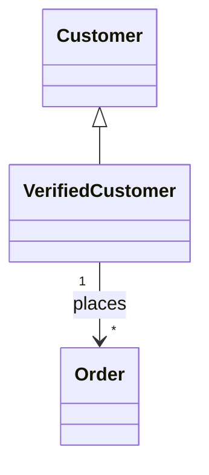

The following guideline outlines a standardized Markdown wiki format for documenting application domain data. It is designed to be human-readable for stakeholders and structured enough to serve as a lightweight semantic layer for engineers. [1, 2, 3] 
## Core Philosophy: The "DataBook" Approach
Treat your documentation as code. [4, 5] 

* Source of Truth: The wiki is version-controlled (Git) alongside the application code.
* Atomicity: Every core concept, rule, or data element gets its own file. This allows precise linking and avoids "monolithic" documents that rot.
* Structured Headers: Use YAML frontmatter at the top of files for machine-readable metadata (owner, status, tags). [6, 7, 8] 

------------------------------
## 1. Directory Structure
Organize the wiki to mirror the domain model rather than the database schema.

```
wiki/
├── 01-concepts/           # Ontology & Taxonomy (The "What")
│   ├── Customer.md
│   ├── Order.md
│   └── Product_Category.md
├── 02-data-dictionary/    # Physical Data & Metadata (The "How")
│   ├── tables/
│   └── fields/
├── 03-rules/             # Business & Validation Rules (The "Why")
│   ├── BR-001_Age_Restriction.md
│   └── VR-102_Email_Format.md
├── 04-lineage/           # Provenance & Data Flow (The "Where")
│   └── flows.md
└── README.md             # Index and Entry Point
```

------------------------------
## 2. Concept & Ontology Template
File Location: 01-concepts/ConceptName.md
Purpose: Defines the "Ubiquitous Language" of the domain. Connects taxonomy (classification) and ontology (relationships).

---id: CNT-001
type: concept
domain: e-commerce
status: approvedowner: "Domain Expert Team"
---
# [Concept Name, e.g., "Verified Customer"]
## DefinitionA clear, one-sentence definition free of technical jargon. *Example: A customer who has completed the KYC process and made at least one successful purchase.*
## Taxonomy*   **Parent Concept:** [[Customer]]
*   **Sub-types:** [[VIP Customer]], [[Corporate Account]]
*   **Synonyms:** `KyCUser`, `ActiveBuyer`
## Ontology / Relationships*   **HAS_A:** [[Wallet]]
*   **PLACES:** [[Order]]
*   **BELONGS_TO:** [[Customer Segment]]
## Diagram<!-- Use Mermaid.js for visual ontology -->

------------------------------
## 3. Data Element (Metadata) Template
File Location: 02-data-dictionary/fields/Field_Name.md
Purpose: Technical specifications, physical storage details, and constraints.

---id: MTD-502
type: field
physical_name: user_email_address
pii: trueclassification: internal
---
# [Business Name, e.g., Email Address]
## Metadata
| Attribute | Value |
| :--- | :--- |
| **Data Type** | `VARCHAR(255)` |
| **Format** | ISO email standard (RFC 5322) |
| **Nullable** | `False` |
| **Default** | `NULL` |
| **Source System** | CRM / Registration Service |
## Validation Rules*   Must be unique per [[Account]].
*   Must correspond to [VR-102 Email Syntax Check](../03-rules/VR-102.md).
## Sample Values*   `jane.doe@example.com`
*   `admin@internal.org`

------------------------------
## 4. Business & Validation Rule Template
File Location: 03-rules/BR-XXX_Rule_Name.md
Purpose: Decouples logic from code. Essential for auditors and QA.

---id: BR-105
type: business_rule
severity: criticalenforcement_level: strict # strict = block transaction, soft = warning
---
# [Rule Name, e.g., Minimum Order for Free Shipping]
## DescriptionOrders must meet a minimum subtotal threshold to qualify for free shipping. This threshold varies by region.
## Logic / Algorithm*   **Input:** `Order.subtotal`, `Customer.shippingAddress.country`*   **Logic:**
    *   IF `country` == 'US' AND `subtotal` >= $50.00 THEN `shipping_cost` = 0
    *   IF `country` == 'CA' AND `subtotal` >= $75.00 CAD THEN `shipping_cost` = 0
    *   ELSE Apply standard shipping rates.
## Provenance & Governance*   **Source Authority:** Marketing Policy Q3-2024 ([Link to Policy Doc]())*   **Effective Date:** 2024-09-01*   **Implemented In:**
    *   `Service: CartCalculationService` (v1.2.0+)
    *   `Method: calculateShipping()`
## Failure Mode*   **Error Code:** `ERR_SHIP_MIN_NOT_MET`
*   **User Message:** "Add $[AMOUNT] more to your cart to get free shipping!"

------------------------------
## 5. Data Provenance & Lineage Template
File Location: 04-lineage/Flow_Name.md
Purpose: Traces the lifecycle of data from origin to consumption.

# Lineage: [Data Flow Name, e.g., User Registration]
## Flow Summary1.  **Source**: User inputs data via `Front-end Web App`.
2.  **Process**: `API Gateway` validates schema.
3.  **Transformation**: `User Service` hashes password and normalizes email.
4.  **Storage**: Persisted to `PrimaryDB (Postgres)`.
5.  **Downstream**: Synced to `Snowflake` via ETL job `nightly_sync_users`.
## Visual Flow```mermaid
graph LR
    A[Web Form] -->|JSON| B(API Gateway)
    B -->|Sanitized Data| C{User Service}
    C -->|Raw SQL| D[(Primary DB)]
    D -.->|CDC Stream| E[(Data Warehouse)]

## Transformation Logic

* Email: Converted to lowercase; whitespace trimmed.
* Phone: Formatted to E.164 standard.


---

### **6. Best Practices for Maintenance**

*   **Linking:** Always use wiki-style links (e.g., `[[Concept Name]]`) to create a navigable graph. If your Markdown editor supports it (like Obsidian or VS Code with plugins), this creates "backlinks" to see everywhere a concept is used.
*   **Tagging:** Use the YAML frontmatter `tags` field (e.g., `tags: [finance, gdpr, v2]`) to allow for filtering.
*   **Diagrams as Code:** Do not paste images. Use **Mermaid.js** or **PlantUML** code blocks so diagrams can be edited textually and versioned with Git.
*   **Review Process:** Changes to "Business Rules" files should require approval (Pull Request review) from a domain expert, not just a developer.

<layout>
genUiCta(queryText="generate a data dictionary and business rule markdown template based on the guideline")
</layout>

