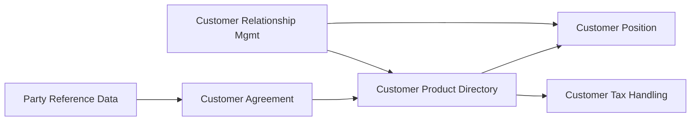

# 📘 BIAN Customer Data Domains Wiki
### *OpenMetadata-Compatible Semantic Contracts for Customer-Centric Banking*

> **Scope**: BIAN Service Domains managing customer identity, relationships, holdings, agreements, and tax data [[3]][[11]][[21]][[41]][[51]][[61]][[71]][[81]]  
> **Format**: OpenMetadata v1.x `Domain` entities with `bian_semantic_contract` custom properties  
> **Version**: BIAN v12.1 / OpenMetadata 1.4+

---

## 🗂️ Table of Contents

1. [Domain Overview Matrix](#domain-overview-matrix)
2. [Party Lifecycle Management](#party-lifecycle-management)
3. [Party Reference Data Directory](#party-reference-data-directory)
4. [Customer Relationship Management](#customer-relationship-management)
5. [Customer Agreement](#customer-agreement)
6. [Customer Product & Service Directory](#customer-product--service-directory)
7. [Customer Tax Handling](#customer-tax-handling)
8. [Customer Position](#customer-position)
9. [OpenMetadata Import Guide](#openmetadata-import-guide)
10. [Business Rules Reference](#business-rules-reference)

---

## 📊 Domain Overview Matrix

| Domain | BIAN Asset Type | Functional Pattern | Core Business Object | Primary Use Case |
|--------|----------------|-------------------|---------------------|-----------------|
| **Party Lifecycle Management** | `PartyRelationship` | `Process` | Party Relationship Lifecycle Phase | KYC/onboarding qualification checks [[11]] |
| **Party Reference Data Directory** | `PartyReferenceData` | `Catalog` | Customer Reference Data Entry | Central party reference for all interactions [[61]] |
| **Customer Relationship Management** | `CustomerRelationship` | `Manage` | Customer Relationship Plan | Relationship development & retention [[21]] |
| **Customer Agreement** | `CustomerAgreement` | `Agree Terms` | Customer Master Agreement | Master legal terms & conditions [[71]] |
| **Customer Product & Service Directory** | `CustomerProductService` | `Catalog` | In-force Product/Service Entry | Holdings inventory (no balances) [[51]] |
| **Customer Tax Handling** | `CustomerTaxObligation` | `Fulfill` | Customer Tax Report | Consolidated tax reporting [[41]] |
| **Customer Position** | `CustomerFinancialPosition` | `Track` | Consolidated Position Statement | Unified financial snapshot [[81]] |

---

## 🧑 Party Lifecycle Management

### Business Context & Rules
```markdown
**Purpose**: Tracks the state of a party relationship with the bank from initial 
qualification checks through ongoing maintenance [[11]].

**Key Business Rules**:
1. Qualification checks MUST vary by party type (individual, corporate, partner) 
   and jurisdiction
2. Regulatory KYC/AML checks MUST be performed before relationship activation
3. Periodic re-assessments MUST follow regulatory schedules or event triggers
4. Status changes MUST generate notifications to dependent service domains
5. All checks MUST be auditable with full provenance

**Lifecycle States**: 
`Prospect` → `Under Review` → `Qualified` → `Active` → `Suspended` → `Terminated`

**Compliance Dependencies**: 
- Local AML/KYC regulations (e.g., FATF, EU AMLD)
- Data residency requirements for party attributes
```

### OpenMetadata Domain Contract
```json
{
  "id": "bian-party-lifecycle-mgmt",
  "name": "Party Lifecycle Management",
  "description": "Tracks party relationship state from initial qualification checks through ongoing maintenance per regulatory requirements.",
  "owner": { "type": "team", "id": "customer-onboarding" },
  "tags": [
    { "tagFQN": "BIAN.ServiceDomain", "source": "manual" },
    { "tagFQN": "BIAN.FunctionalPattern.Process", "source": "manual" },
    { "tagFQN": "DataClassification.PII", "source": "manual" },
    { "tagFQN": "Regulatory.KYC", "source": "manual" }
  ],
  "customProperties": {
    "bian_semantic_contract": {
      "contract_version": "BIAN v12.1",
      "asset_type": "PartyRelationship",
      "functional_pattern": "Process",
      "control_record": "PartyRelationshipProcedure",
      "service_operations": [
        "initiatePartyLifecycle",
        "retrievePartyStatus", 
        "updateQualificationChecks",
        "executePeriodicReassessment",
        "controlLifecycleState"
      ],
      "data_entities": [
        "PartyRelationship",
        "QualificationCheck",
        "RegulatoryRequirement",
        "LifecyclePhase",
        "StatusNotification"
      ],
      "lifecycle_states": ["Prospect", "Under Review", "Qualified", "Active", "Suspended", "Terminated"],
      "business_rules": [
        "Rule-PLM-001: Jurisdiction-specific checklists MUST be applied per party type",
        "Rule-PLM-002: Failed KYC checks MUST halt progression to Active state",
        "Rule-PLM-003: Reassessment triggers MUST include time-based and event-based conditions",
        "Rule-PLM-004: All state transitions MUST emit audit events"
      ],
      "dependencies": [
        "Party Reference Data Directory",
        "Customer Agreement", 
        "Legal Entity Directory",
        "Guideline Compliance"
      ],
      "contract_endpoint_spec": {
        "base_path": "/v1/party/lifecycle",
        "auth": "OAuth2 + Mutual TLS",
        "data_format": "JSON (ISO 20022 party.001 aligned)",
        "rate_limit": "100 req/min per client"
      }
    }
  }
}
```

---

## 📇 Party Reference Data Directory

### Business Context & Rules
```markdown
**Purpose**: Maintains canonical party reference information used across all 
banking interactions including relationship development, sales, servicing, 
and product delivery [[61]].

**Key Business Rules**:
1. Single source of truth for party identifiers (internal IDs, LEI, tax IDs)
2. Demographic data MUST be validated against authoritative sources where available
3. Contact preferences MUST respect channel-specific consent records
4. Association data (e.g., corporate hierarchies) MUST maintain referential integrity
5. Updates MUST propagate to subscribed domains within SLA bounds

**Data Categories**:
- Identity: Legal name, identifiers, tax numbers
- Contact: Addresses, phone, email, preferred channels  
- Demographics: Age band, segment, risk indicators
- Associations: Corporate structures, authorized signatories, relationships

**Governance**: 
- Master Data Management (MDM) ownership required
- Change approval workflow for critical attributes
```

### OpenMetadata Domain Contract
```json
{
  "id": "bian-party-reference-directory",
  "name": "Party Reference Data Directory",
  "description": "Maintains canonical party reference information including identity, contacts, demographics, and associations for use across all banking interactions.",
  "owner": { "type": "team", "id": "master-data-management" },
  "tags": [
    { "tagFQN": "BIAN.ServiceDomain", "source": "manual" },
    { "tagFQN": "BIAN.FunctionalPattern.Catalog", "source": "manual" },
    { "tagFQN": "DataClassification.PII", "source": "manual" },
    { "tagFQN": "DataDomain.ReferenceData", "source": "manual" }
  ],
  "customProperties": {
    "bian_semantic_contract": {
      "contract_version": "BIAN v12.1",
      "asset_type": "PartyReferenceData", 
      "functional_pattern": "Catalog",
      "control_record": "PartyReferenceDataDirectoryEntry",
      "service_operations": [
        "registerPartyEntry",
        "retrievePartyReference",
        "updatePartyAttributes", 
        "controlEntryHandling",
        "executeEntryNotification"
      ],
      "data_entities": [
        "PartyReferenceEntry",
        "IdentityAttributes",
        "ContactDetails", 
        "DemographicIndicators",
        "AssociationRecord",
        "BankingRelationshipLink"
      ],
      "lifecycle_states": ["Draft", "Validated", "Active", "Deprecated", "Archived"],
      "business_rules": [
        "Rule-PRD-001: Party identifiers MUST be globally unique within bank scope",
        "Rule-PRD-002: Contact updates MUST trigger consent re-verification for marketing channels",
        "Rule-PRD-003: Corporate hierarchy changes MUST validate circular reference prevention",
        "Rule-PRD-004: PII attribute changes MUST log before/after values for audit"
      ],
      "dependencies": [
        "Party Lifecycle Management",
        "Legal Entity Directory",
        "Document Directory",
        "Customer Relationship Management"
      ],
      "contract_endpoint_spec": {
        "base_path": "/v1/party/reference",
        "auth": "OAuth2 + API Key",
        "data_format": "JSON (ISO 20022 party.002 aligned)",
        "caching": "ETag-based, 5min TTL for non-PII attributes"
      }
    }
  }
}
```

---

## 🤝 Customer Relationship Management

### Business Context & Rules
```markdown
**Purpose**: Develops and executes customer plans to maintain and build 
relationships through contact management, product matching, and issue 
resolution [[21]].

**Key Business Rules**:
1. Relationship plans MUST include measurable targets and review cycles
2. Product recommendations MUST respect eligibility rules from Customer Product & Service Eligibility domain
3. Customer contact frequency MUST adhere to consent preferences and regulatory limits
4. Issue escalation paths MUST be defined per customer segment and issue severity
5. Relationship performance metrics MUST feed into customer segmentation models

**Operational Scope**:
- Corporate banking & high-net-worth individuals (primary)
- Automated knowledge-based facilities for consumer segment (secondary)

**Integration Points**:
- Triggers: Customer behavior insights, product eligibility changes
- Outputs: Servicing orders, campaign executions, case management
```

### OpenMetadata Domain Contract
```json
{
  "id": "bian-customer-relationship-mgmt",
  "name": "Customer Relationship Management",
  "description": "Develops and executes customer relationship plans including contact management, product matching, sales support, and issue resolution.",
  "owner": { "type": "team", "id": "relationship-management" },
  "tags": [
    { "tagFQN": "BIAN.ServiceDomain", "source": "manual" },
    { "tagFQN": "BIAN.FunctionalPattern.Manage", "source": "manual" },
    { "tagFQN": "BusinessCapability.CustomerEngagement", "source": "manual" }
  ],
  "customProperties": {
    "bian_semantic_contract": {
      "contract_version": "BIAN v12.1",
      "asset_type": "CustomerRelationship",
      "functional_pattern": "Manage", 
      "control_record": "CustomerRelationshipManagementPlan",
      "service_operations": [
        "createRelationshipPlan",
        "retrieveRelationshipStatus",
        "updateRelationshipActivities",
        "executeCustomerContact",
        "controlPlanProcessing"
      ],
      "data_entities": [
        "RelationshipPlan",
        "ContactSchedule",
        "ProductMatchingRule",
        "RelationshipPerformanceMetric",
        "IssueResolutionCase"
      ],
      "lifecycle_states": ["Planned", "In Progress", "Under Review", "Achieved", "At Risk", "Terminated"],
      "business_rules": [
        "Rule-CRM-001: Relationship plans MUST include next-review date and success criteria",
        "Rule-CRM-002: Product recommendations MUST be filtered by Customer Product & Service Eligibility domain output",
        "Rule-CRM-003: Contact attempts MUST respect channel consent and frequency caps",
        "Rule-CRM-004: Escalation thresholds MUST be configurable per customer segment"
      ],
      "dependencies": [
        "Party Reference Data Directory",
        "Customer Product & Service Eligibility",
        "Customer Behavior Insights",
        "Servicing Order",
        "Customer Case"
      ],
      "contract_endpoint_spec": {
        "base_path": "/v1/customer/relationship",
        "auth": "OAuth2 + Role-Based Access Control",
        "data_format": "JSON (BIAN canonical schema)",
        "eventing": "Webhook support for plan milestone events"
      }
    }
  }
}
```

---

## 📜 Customer Agreement

### Business Context & Rules
```markdown
**Purpose**: Captures and maintains the master legal terms and conditions 
in force for a customer, which may be a complex multinational entity with 
multiple subsidiary agreements [[71]].

**Key Business Rules**:
1. Master agreement MUST be established before any product-specific agreements
2. Legal, regulatory, and corporate policy terms MUST be explicitly captured and versioned
3. Proposed transactions MUST be validated against agreement terms before execution
4. Agreement amendments MUST follow change control workflow with approval tracking
5. Multi-jurisdictional customers MUST have territory-specific clauses managed

**Agreement Structure**:
```
Customer Master Agreement
├── Legal Terms (governing law, dispute resolution)
├── Regulatory Terms (compliance obligations)  
├── Corporate Policy Terms (internal bank policies)
└── Linked Sales Product Agreements (1..n)
```

**Audit Requirements**:
- Full version history with change rationale
- Signature/approval trail for amendments
- Effective date management for term changes
```

### OpenMetadata Domain Contract
```json
{
  "id": "bian-customer-agreement",
  "name": "Customer Agreement",
  "description": "Maintains the master customer legal agreement including legal, regulatory, and corporate policy terms, linked to product-specific agreements.",
  "owner": { "type": "team", "id": "legal-compliance" },
  "tags": [
    { "tagFQN": "BIAN.ServiceDomain", "source": "manual" },
    { "tagFQN": "BIAN.FunctionalPattern.AgreeTerms", "source": "manual" },
    { "tagFQN": "DataClassification.Legal", "source": "manual" },
    { "tagFQN": "Regulatory.ContractManagement", "source": "manual" }
  ],
  "customProperties": {
    "bian_semantic_contract": {
      "contract_version": "BIAN v12.1",
      "asset_type": "CustomerAgreement",
      "functional_pattern": "Agree Terms",
      "control_record": "CustomerMasterAgreement",
      "service_operations": [
        "establishCustomerAgreement",
        "retrieveAgreementTerms",
        "updateAgreementClauses",
        "evaluateTermCompatibility",
        "controlAgreementProcessing"
      ],
      "data_entities": [
        "MasterAgreement",
        "LegalTermClause",
        "RegulatoryTermClause", 
        "CorporatePolicyClause",
        "LinkedProductAgreement",
        "AmendmentRecord"
      ],
      "lifecycle_states": ["Draft", "Under Review", "Executed", "Amended", "Suspended", "Terminated"],
      "business_rules": [
        "Rule-CA-001: Master agreement MUST precede any Sales Product Agreement creation",
        "Rule-CA-002: Term compatibility checks MUST be synchronous for high-risk transactions",
        "Rule-CA-003: Multi-jurisdiction agreements MUST maintain territory-specific clause versions",
        "Rule-CA-004: All amendments MUST capture approver identity and effective date"
      ],
      "dependencies": [
        "Party Lifecycle Management",
        "Legal Entity Directory",
        "Guideline Compliance",
        "Sales Product Agreement"
      ],
      "contract_endpoint_spec": {
        "base_path": "/v1/customer/agreement",
        "auth": "OAuth2 + Legal Role Authorization",
        "data_format": "JSON/XML (ISO 20022 agreement.001 aligned)",
        "encryption": "Field-level encryption for sensitive clause content"
      }
    }
  }
}
```

---

## 📦 Customer Product & Service Directory (Product Holding)

### Business Context & Rules
```markdown
**Purpose**: Maintains details of all products and services a customer has 
acquired from the bank, including current state and selected features, but 
NOT usage or balance information [[51]].

**Key Business Rules**:
1. This is the SINGLE SOURCE OF TRUTH for customer holdings inventory
2. Product entries MUST include configuration details (features, options, terms)
3. State changes (e.g., product suspension) MUST be reflected in real-time
4. Historical product records MUST be retained for regulatory reporting periods
5. Updates MUST be triggered by successful Customer Offer or Servicing Order completion

**Data Scope (IN)**:
- Product/service identifiers and types
- Selected features, options, and configuration parameters  
- Current availability state (active, suspended, pending closure)
- Relationship to master agreement and eligibility rules

**Data Scope (OUT)**:
- Transaction balances, usage metrics, performance data
- Pricing calculations or fee assessments
```

### OpenMetadata Domain Contract
```json
{
  "id": "bian-customer-product-directory",
  "name": "Customer Product and Service Directory",
  "description": "Maintains the definitive inventory of products and services acquired by a customer, including configuration details and current state (excludes balances/usage).",
  "owner": { "type": "team", "id": "product-operations" },
  "tags": [
    { "tagFQN": "BIAN.ServiceDomain", "source": "manual" },
    { "tagFQN": "BIAN.FunctionalPattern.Catalog", "source": "manual" },
    { "tagFQN": "DataDomain.ProductHolding", "source": "manual" }
  ],
  "customProperties": {
    "bian_semantic_contract": {
      "contract_version": "BIAN v12.1",
      "asset_type": "CustomerProductService",
      "functional_pattern": "Catalog",
      "control_record": "CustomerProductAndServiceDirectoryEntry",
      "service_operations": [
        "registerProductEntry",
        "retrieveCustomerHoldings",
        "updateProductConfiguration",
        "controlEntryState",
        "executeEntryNotification"
      ],
      "data_entities": [
        "ProductDirectoryEntry",
        "ProductConfiguration",
        "FeatureSelection",
        "ProductStateIndicator",
        "AgreementLinkage"
      ],
      "lifecycle_states": ["Pending Activation", "Active", "Suspended", "Pending Closure", "Closed", "Archived"],
      "business_rules": [
        "Rule-CPSD-001: Product entries MUST be created only upon successful offer acceptance or servicing order completion",
        "Rule-CPSD-002: Configuration changes MUST preserve audit trail of prior feature selections",
        "Rule-CPSD-003: State transitions MUST trigger notifications to Customer Position and Tax Handling domains",
        "Rule-CPSD-004: Historical records MUST be retained per jurisdictional regulatory requirements"
      ],
      "dependencies": [
        "Customer Agreement",
        "Customer Product & Service Eligibility",
        "Customer Position",
        "Customer Tax Handling",
        "Product Directory"
      ],
      "contract_endpoint_spec": {
        "base_path": "/v1/customer/products",
        "auth": "OAuth2 + Product Access Scope",
        "data_format": "JSON (BIAN product.001 canonical)",
        "query_support": "Filter by product type, state, agreement ID, date range"
      }
    }
  }
}
```

---

## 💰 Customer Tax Handling

### Business Context & Rules
```markdown
**Purpose**: Handles consolidation and reporting of tax-related activity for 
customers across products and services. NOTE: This domain handles reporting 
ONLY; actual tax processing occurs in product-specific domains [[41]].

**Key Business Rules**:
1. Tax reporting obligations MUST be maintained per customer jurisdiction and product type
2. Consolidation MUST aggregate transaction data from all in-force product domains
3. Reports MUST comply with jurisdiction-specific formats (e.g., IRS 1099, EU DAC6)
4. Year-end reports MUST be generated within regulatory deadlines
5. Ad-hoc report requests MUST respect data access permissions and audit requirements

**Reporting Scope**:
- Interest income/expense reporting
- Capital gains/losses aggregation  
- Withholding tax summaries
- Cross-border transaction reporting (FATCA, CRS)

**Separation of Concerns**:
✅ Consolidates tax-relevant data from product domains  
✅ Formats reports per jurisdictional requirements  
❌ Does NOT calculate tax liabilities  
❌ Does NOT process tax payments or filings
```

### OpenMetadata Domain Contract
```json
{
  "id": "bian-customer-tax-handling",
  "name": "Customer Tax Handling",
  "description": "Consolidates tax-relevant activity across customer products and generates jurisdiction-compliant tax reports (reporting only, not tax calculation/processing).",
  "owner": { "type": "team", "id": "tax-compliance" },
  "tags": [
    { "tagFQN": "BIAN.ServiceDomain", "source": "manual" },
    { "tagFQN": "BIAN.FunctionalPattern.Fulfill", "source": "manual" },
    { "tagFQN": "Regulatory.TaxReporting", "source": "manual" },
    { "tagFQN": "DataClassification.Financial", "source": "manual" }
  ],
  "customProperties": {
    "bian_semantic_contract": {
      "contract_version": "BIAN v12.1",
      "asset_type": "CustomerTaxObligation",
      "functional_pattern": "Fulfill",
      "control_record": "CustomerTaxObligationArrangement",
      "service_operations": [
        "initiateTaxReporting",
        "retrieveTaxReport",
        "updateConsolidatedData",
        "executeReportGeneration",
        "controlReportingProcess"
      ],
      "data_entities": [
        "TaxReportingObligation",
        "ConsolidatedTransactionRecord",
        "JurisdictionalReportTemplate",
        "ReportGenerationLog",
        "CustomerTaxSummary"
      ],
      "lifecycle_states": ["Configured", "Data Collection", "Processing", "Generated", "Delivered", "Archived"],
      "business_rules": [
        "Rule-CTH-001: Tax obligations MUST be configured per customer jurisdiction and product type combination",
        "Rule-CTH-002: Data consolidation MUST pull from all active product domains per Customer Product Directory",
        "Rule-CTH-003: Report formats MUST be validated against jurisdictional schema before delivery",
        "Rule-CTH-004: All report generations MUST log source data snapshots for audit reproducibility"
      ],
      "dependencies": [
        "Customer Product and Service Directory",
        "Customer Agreement",
        "Legal Entity Directory",
        "Document Services"
      ],
      "contract_endpoint_spec": {
        "base_path": "/v1/customer/tax",
        "auth": "OAuth2 + Tax Compliance Role",
        "data_format": "JSON/XML (jurisdiction-specific schemas: IRS, HMRC, etc.)",
        "delivery": "Secure file transfer + email notification for report availability"
      }
    }
  }
}
```

---

## 📊 Customer Position

### Business Context & Rules
```markdown
**Purpose**: Maintains a consolidated financial position for a customer by 
combining details from all products and services in use [[81]].

**Key Business Rules**:
1. Position MUST aggregate balances, exposures, and limits across all product domains
2. Real-time position updates MUST be triggered by transaction events in source domains
3. Currency conversion MUST use bank-approved exchange rates with timestamp tracking
4. Position snapshots MUST be retained for regulatory capital and reporting requirements
5. Access to consolidated position MUST respect customer data sharing permissions

**Aggregation Scope**:
- Deposit account balances (current, savings, term)
- Credit facility utilizations and available limits
- Investment portfolio valuations
- Derivative exposures and collateral positions
- Off-balance sheet commitments

**Performance Requirements**:
- Near-real-time aggregation (<5 min latency for retail, <1 min for trading)
- Point-in-time reconstruction capability for audit
- Multi-currency normalization with rate provenance
```

### OpenMetadata Domain Contract
```json
{
  "id": "bian-customer-position",
  "name": "Customer Position",
  "description": "Maintains consolidated financial position aggregating balances, exposures, and limits across all customer products and services with real-time update capability.",
  "owner": { "type": "team", "id": "financial-reporting" },
  "tags": [
    { "tagFQN": "BIAN.ServiceDomain", "source": "manual" },
    { "tagFQN": "BIAN.FunctionalPattern.Track", "source": "manual" },
    { "tagFQN": "DataDomain.FinancialPosition", "source": "manual" },
    { "tagFQN": "Performance.RealTime", "source": "manual" }
  ],
  "customProperties": {
    "bian_semantic_contract": {
      "contract_version": "BIAN v12.1",
      "asset_type": "CustomerFinancialPosition",
      "functional_pattern": "Track",
      "control_record": "CustomerConsolidatedPosition",
      "service_operations": [
        "retrieveCustomerPosition",
        "updatePositionAggregation",
        "executePositionSnapshot",
        "controlPositionCalculation",
        "notifyPositionChange"
      ],
      "data_entities": [
        "ConsolidatedPositionStatement",
        "BalanceAggregation",
        "ExposureCalculation",
        "LimitUtilization",
        "CurrencyConversionRecord",
        "PositionSnapshot"
      ],
      "lifecycle_states": ["Calculating", "Validated", "Published", "Snapshot Created", "Archived"],
      "business_rules": [
        "Rule-CP-001: Position aggregation MUST include all active products from Customer Product Directory",
        "Rule-CP-002: Currency conversions MUST use timestamped exchange rates from approved source",
        "Rule-CP-003: Position updates MUST be triggered within SLA bounds by source domain events",
        "Rule-CP-004: Historical snapshots MUST be retained per regulatory capital reporting requirements"
      ],
      "dependencies": [
        "Customer Product and Service Directory",
        "Current Account",
        "Credit Facility", 
        "Investment Portfolio Management",
        "Risk Management"
      ],
      "contract_endpoint_spec": {
        "base_path": "/v1/customer/position",
        "auth": "OAuth2 + Financial Data Scope",
        "data_format": "JSON (ISO 20022 camt.052/053 aligned)",
        "caching": "Read-through cache with event-based invalidation",
        "latency_sla": "<5 min retail, <1 min trading/corporate"
      }
    }
  }
}
```

---

## 🚀 OpenMetadata Import Guide

### Prerequisites
```bash
# OpenMetadata server must be running with API access
OPENMETADATA_HOST="https://your-openmetadata-instance"
API_TOKEN="your-service-account-token"
```

### Bulk Import Command
```bash
curl -X POST "${OPENMETADATA_HOST}/api/v1/domains/bulkCreate" \
  -H "Authorization: Bearer ${API_TOKEN}" \
  -H "Content-Type: application/json" \
  -d '@bian_customer_domains.json'
```

### Post-Import Enrichment Steps

1. **Create Glossary Terms for Data Entities**
```json
{
  "glossaryTerms": [
    {
      "name": "PartyRelationship",
      "description": "Represents the qualified relationship between a party and the bank",
      "domain": "bian-party-lifecycle-mgmt"
    },
    {
      "name": "CustomerTaxObligation", 
      "description": "Tax reporting requirement for a customer in a specific jurisdiction",
      "domain": "bian-customer-tax-handling"
    }
  ]
}
```

2. **Establish Lineage Relationships**


3. **Apply Data Classification Tags**
```bash
# Tag PII fields across domains
openmetadata-cli tag add \
  --resource-type domain \
  --resource-id "bian-party-reference-directory" \
  --tag "DataClassification.PII"
```

---

## 📋 Business Rules Reference

### Cross-Domain Validation Rules
| Rule ID | Description | Affected Domains | Enforcement Point |
|---------|-------------|-----------------|------------------|
| `CUST-001` | Party MUST be Qualified before Agreement creation | Party Lifecycle, Customer Agreement | Agreement establishment |
| `CUST-002` | Product holdings MUST reference valid Agreement | Product Directory, Customer Agreement | Product registration |
| `CUST-003` | Tax reporting requires active Product entries | Tax Handling, Product Directory | Report generation |
| `CUST-004` | Position aggregation excludes suspended products | Customer Position, Product Directory | Position calculation |
| `CUST-005` | Relationship plans respect product eligibility | Relationship Mgmt, Product Eligibility | Recommendation engine |

### Regulatory Compliance Rules
| Regulation | Requirement | Implemented By |
|------------|-------------|---------------|
| **GDPR/CCPA** | PII access logging & consent tracking | Party Reference Data Directory |
| **AML/KYC** | Periodic customer re-qualification | Party Lifecycle Management |
| **FATCA/CRS** | Cross-border tax reporting | Customer Tax Handling |
| **BCBS 239** | Risk data aggregation principles | Customer Position |
| **MiFID II** | Product suitability documentation | Customer Relationship Management |

---

> ℹ️ **Implementation Notes**  
> - All domains follow BIAN's "one asset type + one functional pattern" design principle [[16]]  
> - Semantic contracts use OpenMetadata's extensible `customProperties` for BIAN-specific metadata  
> - For production: break `bian_semantic_contract` into native OpenMetadata entities (GlossaryTerms, Tags, Lineage) for better discoverability  
> - BIAN Service Landscape v12.1 referenced; validate against latest version at [bian.org](https://bian.org) [[3]]

*Generated for architecture documentation purposes. Validate contracts against your organization's BIAN implementation guide and OpenMetadata schema registry.*