## Group Context
- Folder group: guidelines
- Related raw sources in this group:
  - /raw/guidelines/guideline_bian_customer_data_domain_wiki.md
  - /raw/guidelines/guideline_CDMS_Architecture_Wiki.md
  - /raw/guidelines/guideline_openmetadata.md
  - /raw/guidelines/OECD_Guidance_for_the_Standard_Audit_File_Tax_v2.0.pdf

## Source Content
# OECD Standard Audit File-Tax (SAF-T) v2.0 Schema Wiki

> **Document**: Guidance for the Standard Audit File-Tax, Version 2.0 – Appendix B: SAF-T Schema  
> **Schema Location**: `SAF-T_Schema_v_2.00.xsd`  
> **Target Namespace**: `urn:OECD:StandardAuditFile-Taxation/2.00`  
> **Attribute Form Default**: `unqualified`  
> **Element Form Default**: `qualified`

---

## Table of Contents

1. [Overview](#overview)
2. [Root Element: AuditFile](#root-element-auditfile)
3. [Main Structural Sections](#main-structural-sections)
4. [Header Section](#header-section)
5. [MasterFiles Section](#masterfiles-section)
6. [GeneralLedgerEntries Section](#generalledgerentries-section)
7. [SourceDocuments Section](#sourcedocuments-section)
8. [Complex Types Reference](#complex-types-reference)
9. [Simple Types Reference](#simple-types-reference)
10. [Common Structures](#common-structures)

---

## Overview

The **Standard Audit File-Tax (SAF-T)** is an international standard developed by the OECD for the electronic exchange of accounting data between organizations and tax authorities. Version 2.0 provides a comprehensive XML schema for reporting:

- General ledger accounts and transactions
- Master data (customers, suppliers, products, assets)
- Source documents (invoices, payments, stock movements)
- Tax information and calculations

### Key Features
- ✅ Modular design with extensible extension points
- ✅ Support for multi-currency transactions
- ✅ Comprehensive tax calculation and reporting
- ✅ Asset depreciation and valuation tracking
- ✅ Physical stock and inventory management

---

## Root Element: AuditFile

```xml
<element name="AuditFile">
  <children>
    - Header
    - MasterFiles (optional)
    - GeneralLedgerEntries (optional)
    - SourceDocuments (optional)
  </children>
</element>
```

| Child Element | Required | Description |
|--------------|----------|-------------|
| `Header` | Yes | General information about the file, software, company, and selection criteria |
| `MasterFiles` | No | Standing data: accounts, taxonomies, customers, suppliers, products, etc. |
| `GeneralLedgerEntries` | No | Journal entries and transaction lines |
| `SourceDocuments` | No | Source documents: invoices, payments, goods movements, asset transactions |

---

## Main Structural Sections

```mermaid
graph TD
    A[AuditFile] --> B[Header]
    A --> C[MasterFiles]
    A --> D[GeneralLedgerEntries]
    A --> E[SourceDocuments]
    
    C --> C1[GeneralLedgerAccounts]
    C --> C2[Taxonomies]
    C --> C3[Customers]
    C --> C4[Suppliers]
    C --> C5[TaxTable]
    C --> C6[UOMTable]
    C --> C7[AnalysisTypeTable]
    C --> C8[MovementTypeTable]
    C --> C9[Products]
    C --> C10[PhysicalStock]
    C --> C11[Owners]
    C --> C12[Assets]
    
    D --> D1[NumberOfEntries]
    D --> D2[TotalDebit]
    D --> D3[TotalCredit]
    D --> D4[Journal]
    
    E --> E1[SalesInvoices]
    E --> E2[PurchaseInvoices]
    E --> E3[Payments]
    E --> E4[MovementOfGoods]
    E --> E5[AssetTransactions]
```



---

## Header Section

### Element: `AuditFile/Header`

**Type**: `HeaderStructure` (extension)

| Element | Type | Required | Description |
|---------|------|----------|-------------|
| `AuditFileVersion` | `SAFcodeType` | Yes | SAF-T version identifier (max 9 chars) |
| `AuditFileCountry` | `ISOCountryCode` | Yes | ISO 3166-1 alpha-2 country code |
| `AuditFileRegion` | `SAFcodeType` | No | Regional code per ISO 3166-2 |
| `AuditFileDateCreated` | `xs:date` | Yes | Production date of SAF-T file |
| `SoftwareCompanyName` | `SAFmiddle2textType` | Yes | Name of software vendor |
| `SoftwareID` | `SAFlongtextType` | Yes | Name of generating software |
| `SoftwareVersion` | `SAFshorttextType` | Yes | Software version |
| `Company` | `CompanyHeaderStructure` | Yes | Company identification details |
| `DefaultCurrencyCode` | `ISOCurrencyCode` | Yes | ISO 4217 currency code (default) |
| `SelectionCriteria` | `SelectionCriteriaStructure` | No | Data selection parameters |
| `HeaderComment` | `SAFlongtextType` | No | Additional comments |
| `TaxAccountingBasis` | `SAFshorttextType` | Yes | Invoice/Cash/Delivery accounting |
| `TaxEntity` | `SAFmiddle2textType` | No | Company/Division/Branch reference |

### Selection Criteria Structure

```xml
<element name="SelectionCriteria">
  <children>
    - TaxReportingJurisdiction (optional)
    - CompanyEntity (optional)
    - SelectionStartDate (required)
    - SelectionEndDate (required)
    - PeriodStart / PeriodStartYear (optional)
    - PeriodEnd / PeriodEndYear (optional)
    - DocumentType (optional)
    - OtherCriteria (optional, unbounded)
  </children>
</element>
```

---

## MasterFiles Section

### General Ledger Accounts

```xml
<element name="GeneralLedgerAccounts">
  <child name="Account" minOccurs="1" maxOccurs="unbounded">
    <children>
      - AccountID (SAFmiddle2textType, max 70) ★
      - AccountDescription (SAFlongtextType, max 256)
      - StandardAccountID (SAFmiddle1textType, max 35, optional)
      - GroupingCategory / GroupingCode (optional)
      - AccountType (SAFshorttextType): Asset/Liability/Sale/Expense
      - AccountCreationDate (xs:date, optional)
      - OpeningDebitBalance / OpeningCreditBalance (SAFmonetaryType)
      - ClosingDebitBalance / ClosingCreditBalance (SAFmonetaryType)
    </children>
  </child>
</element>
```

### Customers & Suppliers

Both extend `CompanyStructure` with additional fields:

| Element | Type | Description |
|---------|------|-------------|
| `CustomerID` / `SupplierID` | `SAFmiddle1textType` | Unique identifier |
| `SelfBillingIndicator` | `SAFcodeType` | Self-billing agreement flag |
| `AccountID` | `SAFmiddle2textType` | Linked GL account |
| `Opening/Closing Debit/Credit Balance` | `SAFmonetaryType` | Period balances |

### Tax Table Structure

```xml
<TaxTable>
  <TaxTableEntry>
    - TaxType (SAFcodeType)
    - Description (SAFlongtextType)
    <TaxCodeDetails>
      - TaxCode (SAFcodeType) ★
      - EffectiveDate / ExpirationDate (xs:date, optional)
      - Description (SAFlongtextType, optional)
      - TaxPercentage (xs:decimal, optional)
      - FlatTaxRate (AmountStructure, optional)
      - Country (ISOCountryCode)
      - Region (SAFcodeType, optional)
    </TaxCodeDetails>
  </TaxTableEntry>
</TaxTable>
```

### Products

```xml
<Product>
  - ProductCode (SAFmiddle2textType) ★
  - GoodsServicesID (SAFcodeType, optional): goods/services indicator
  - ProductGroup (SAFmiddle2textType, optional)
  - Description (SAFlongtextType)
  - ProductCommodityCode (SAFmiddle1textType, optional): import/export classification
  - ProductNumberCode (SAFmiddle2textType, optional): EAN/other
  - ValuationMethod (SAFcodeType, optional): FIFO/LIFO/Average
  - UOMBase / UOMStandard (SAFcodeType)
  - UOMToUOMBaseConversionFactor (xs:decimal)
  <Tax> (optional, unbounded)
    - TaxType / TaxCode (SAFcodeType)
  </Tax>
</Product>
```

### Physical Stock

```xml
<PhysicalStockEntry>
  - WarehouseID / LocationID (optional)
  - ProductCode (SAFmiddle2textType) ★
  - StockAccountNo (SAFmiddle2textType, optional): batch/lot/serial
  - ProductType / ProductStatus (SAFshorttextType, optional)
  - StockAccountCommodityCode (SAFmiddle1textType, optional)
  - OwnerID (SAFmiddle1textType, optional)
  - UOMPhysicalStock (SAFcodeType)
  - UOMToUOMBaseConversionFactor (xs:decimal)
  - UnitPrice (SAFmonetaryType, optional)
  - OpeningStockQuantity (SAFquantityType) ★
  - OpeningStockValue (SAFmonetaryType, optional)
  - ClosingStockQuantity (SAFquantityType) ★
  - ClosingStockValue (SAFmonetaryType, optional)
  <StockCharacteristics> (optional)
    - StockCharacteristic / StockCharacteristicValue
  </StockCharacteristics>
</PhysicalStockEntry>
```

### Assets & Valuations

```xml
<Asset>
  - AssetID (SAFmiddle1textType) ★
  - AccountID (SAFmiddle2textType)
  - Description (SAFlongtextType)
  <Supplier> (optional, unbounded)
    - SupplierName / SupplierID / PostalAddress
  </Supplier>
  - PurchaseOrderDate / DateOfAcquisition / StartUpDate (xs:date)
  <Valuations>
    <Valuation> (unbounded)
      - AssetValuationType: commercial/tax-country1/tax-country2
      - ValuationClass
      - AcquisitionAndProductionCostsBegin/End (SAFmonetaryType)
      - InvestmentSupport (SAFmonetaryType, optional)
      - AssetLifeYear / AssetLifeMonth (xs:decimal)
      - AssetAddition / Transfers / AssetDisposal (SAFmonetaryType, optional)
      - BookValueBegin / BookValueEnd (SAFmonetaryType)
      - DepreciationMethod (SAFmiddle1textType, optional)
      - DepreciationPercentage (xs:decimal, optional)
      - DepreciationForPeriod (SAFmonetaryType) ★
      - AppreciationForPeriod (SAFmonetaryType, optional)
      <ExtraordinaryDepreciationsForPeriod> (optional)
        - ExtraordinaryDepreciationMethod / Amount
      </ExtraordinaryDepreciationsForPeriod>
      - AccumulatedDepreciation (SAFmonetaryType, optional)
    </Valuation>
  </Valuations>
</Asset>
```

---

## GeneralLedgerEntries Section

### Journal Structure

```xml
<GeneralLedgerEntries>
  - NumberOfEntries (xs:nonNegativeInteger)
  - TotalDebit / TotalCredit (SAFmonetaryType)
  <Journal> (optional, unbounded)
    - JournalID (SAFshorttextType) ★
    - Description (SAFlongtextType)
    - Type (SAFcodeType): grouping mechanism
    <Transaction> (optional, unbounded)
      - TransactionID (SAFmiddle2textType) ★
      - Period / PeriodYear (1970-2100)
      - TransactionDate / SystemEntryDate / GLPostingDate (xs:date)
      - SourceID (SAFmiddle1textType, optional): entry source
      - TransactionType (SAFshorttextType, optional)
      - Description (SAFlongtextType)
      - BatchID / SystemID (optional)
      - CustomerID / SupplierID (SAFmiddle1textType, optional)
      <Line> (minOccurs="1", unbounded)
        - RecordID (SAFshorttextType) ★
        - AccountID (SAFmiddle2textType) ★
        <Analysis> (optional, unbounded)
          - AnalysisType / AnalysisID / AnalysisAmount
        </Analysis>
        - ValueDate (xs:date, optional)
        - SourceDocumentID (SAFmiddle1textType, optional)
        - CustomerID / SupplierID (optional)
        - Description (SAFlongtextType)
        - DebitAmount / CreditAmount (AmountStructure)
        <TaxInformation> (optional, unbounded) -> see TaxInformationStructure
      </Line>
    </Transaction>
  </Journal>
</GeneralLedgerEntries>
```

---

## SourceDocuments Section

### Invoice Structure (Sales & Purchase)

```xml
<Invoice> (InvoiceStructure)
  - InvoiceNo (SAFmiddle2textType) ★
  <CustomerInfo> / <SupplierInfo>
    - CustomerID/SupplierID, Name, BillingAddress
  </CustomerInfo>
  - AccountID (SAFmiddle2textType, optional): linked GL account
  - BranchStoreNumber (SAFmiddle1textType, optional)
  - Period / PeriodYear (optional)
  - InvoiceDate (xs:date) ★
  - InvoiceType (SAFcodeType, optional): Debit/Credit/Cash/Ticket
  - ShipTo / ShipFrom (ShippingPointStructure, optional)
  - PaymentTerms / SelfBillingIndicator / SourceID (optional)
  - GLPostingDate / BatchID / SystemID / TransactionID (optional)
  - ReceiptNumbers (SAFlongtextType, optional): consolidated invoice refs
  <Line> (minOccurs="1", unbounded)
    - LineNumber (SAFshorttextType, optional)
    - AccountID (SAFmiddle2textType, optional)
    <Analysis> (optional, unbounded)
    <OrderReferences> (optional, unbounded)
      - OriginatingON / OrderDate
    </OrderReferences>
    - ShipTo / ShipFrom (optional)
    - GoodsServicesID (SAFcodeType, optional)
    - ProductCode / ProductDescription (optional)
    <Delivery> (optional)
      - MovementReference (unbounded) / DeliveryDate / DeliveryPeriod
    </Delivery>
    - Quantity (SAFquantityType, optional)
    - InvoiceUOM (SAFcodeType, optional)
    - UOMToUOMBaseConversionFactor (xs:decimal, optional)
    - UnitPrice (SAFmonetaryType)
    - TaxPointDate (xs:date)
    <References> (optional)
      <CreditNote>
        - Reference / Reason
      </CreditNote>
    </References>
    - Description (SAFlongtextType)
    - InvoiceLineAmount (AmountStructure) ★
    - DebitCreditIndicator: D/C (required)
    - ShippingCostsAmount (AmountStructure, optional)
    <TaxInformation> (optional, unbounded)
  </Line>
  <Settlement> (optional)
    - SettlementDiscount / SettlementAmount / SettlementDate / PaymentMechanism
  </Settlement>
  <DocumentTotals> (optional)
    <TaxInformationTotals> (unbounded)
    - ShippingCostsAmountTotal / NetTotal / GrossTotal (SAFmonetaryType)
  </DocumentTotals>
</Invoice>
```

### Payments Structure

```xml
<Payment>
  - PaymentRefNo (SAFmiddle1textType) ★
  - Period / PeriodYear (optional)
  - TransactionID / TransactionDate (optional)
  - PaymentMethod (SAFcodeType, optional): Cheque/Bank/Giro/Cash
  - Description / BatchID / SystemID / SourceID (optional)
  <Line> (minOccurs="1", unbounded)
    - LineNumber (SAFshorttextType, optional)
    - SourceDocumentID (SAFmiddle1textType, optional)
    - AccountID (SAFmiddle2textType, optional)
    <Analysis> (optional, unbounded)
    - CustomerID / SupplierID (optional)
    - TaxPointDate (xs:date, optional)
    - Description (SAFlongtextType, optional)
    - DebitCreditIndicator: D/C (required)
    - PaymentLineAmount (AmountStructure) ★
    <TaxInformation> (optional, unbounded)
  </Line>
  <Settlement> (optional)
  <DocumentTotals> (optional)
</Payment>
```

### Movement of Goods

```xml
<StockMovement>
  - MovementReference (SAFmiddle1textType) ★
  - MovementDate (xs:date) ★
  - MovementPostingDate / MovementPostingTime (optional)
  - TaxPointDate (xs:date, optional)
  - MovementType (SAFcodeType): production/sales/purchase
  - SourceID / SystemID (optional)
  <DocumentReference> (optional)
    - DocumentType / DocumentNumber / DocumentLine
  </DocumentReference>
  <Line> (minOccurs="1", unbounded)
    - LineNumber (SAFshorttextType)
    - AccountID / TransactionID (optional)
    - CustomerID / SupplierID (optional)
    - ShipTo / ShipFrom (ShippingPointStructure, optional)
    - ProductCode (SAFmiddle2textType) ★
    - StockAccountNo (SAFmiddle2textType, optional)
    - Quantity (SAFquantityType) ★
    - UnitOfMeasure (SAFcodeType)
    - UOMToUOMPhysicalStockConversionFactor (xs:decimal)
    - BookValue (SAFmonetaryType, optional)
    - MovementSubType (SAFcodeType, optional)
    - MovementComments (SAFlongtextType, optional)
    <TaxInformation> (optional, unbounded)
  </Line>
</StockMovement>
```

### Asset Transactions

```xml
<AssetTransaction>
  - AssetTransactionID (SAFmiddle2textType) ★
  - AssetID (SAFmiddle1textType) ★
  - AssetTransactionType (SAFcodeType) ★
  - Description (SAFlongtextType, optional)
  - AssetTransactionDate (xs:date) ★
  <Supplier> (optional)
  - TransactionID (SAFmiddle2textType, optional)
  <AssetTransactionValuations>
    <AssetTransactionValuation> (unbounded)
      - AssetValuationType (SAFshorttextType, optional)
      - AcquisitionAndProductionCostsOnTransaction (SAFmonetaryType)
      - BookValueOnTransaction (SAFmonetaryType)
      - AssetTransactionAmount (SAFmonetaryType): net amount
    </AssetTransactionValuation>
  </AssetTransactionValuations>
</AssetTransaction>
```

---

## Complex Types Reference

### Common Structures

| Type | Purpose | Key Elements |
|------|---------|-------------|
| `AddressStructure` | Reusable address format | StreetName, Number, City, PostalCode, Region, Country, AddressType |
| `AmountStructure` | Monetary amounts with currency | Amount, CurrencyCode, CurrencyAmount, ExchangeRate |
| `BankAccountStructure` | Bank account details | IBANNumber, BankAccountNumber, BankAccountName, SortCode |
| `CompanyStructure` | Company identification | RegistrationNumber, Name, Address, Contact, TaxRegistration, BankAccount |
| `CompanyHeaderStructure` | Company (restricted, mandatory fields) | Same as CompanyStructure but RegistrationNumber & Telephone required |
| `ContactInformationStructure` | Contact details | ContactPerson, Telephone, Fax, Email, Website |
| `ContactHeaderStructure` | Contact (restricted) | Same but Telephone mandatory |
| `PersonNameStructure` | Natural person name | Title, FirstName, Initials, LastNamePrefix, LastName, BirthName, Salutation |
| `SelectionCriteriaStructure` | Data selection parameters | Dates, periods, jurisdiction, entity filters |
| `ShippingPointStructure` | Delivery location info | DeliveryID, DeliveryDate, WarehouseID, LocationID, UCR, Address |
| `TaxIDStructure` | Tax registration info | TaxRegistrationNumber, TaxType, TaxNumber, TaxAuthority, TaxVerificationDate |
| `TaxInformationStructure` | Tax calculation details | TaxType, TaxCode, TaxPercentage, TaxBase, TaxAmount, ExemptionReason |
| `AnalysisStructure` | GL analysis codes | AnalysisType, AnalysisID, AnalysisAmount |
| `InvoiceStructure` | Complete invoice record | See Invoice Structure section above |

---

## Simple Types Reference

| Type | Base Type | Constraints | Usage |
|------|-----------|-------------|-------|
| `ISOCountryCode` | `xs:string` | `length=2` | ISO 3166-1 alpha-2 country codes |
| `ISOCurrencyCode` | `xs:string` | `length=3` | ISO 4217 currency codes |
| `SAFcodeType` | `xs:string` | `maxLength=9` | Short codes for types, indicators, references |
| `SAFexchangerateType` | `xs:decimal` | `totalDigits=18, fractionDigits=8` | Currency exchange rates |
| `SAFlongtextType` | `xs:string` | `maxLength=256` | Descriptions, comments, long text |
| `SAFmiddle1textType` | `xs:string` | `maxLength=35` | IDs, codes, short names |
| `SAFmiddle2textType` | `xs:string` | `maxLength=70` | Names, descriptions, account IDs |
| `SAFmonetaryType` | `xs:decimal` | `totalDigits=18, fractionDigits=2` | Monetary amounts in default currency |
| `SAFquantityType` | `xs:decimal` | `totalDigits=22, fractionDigits=6` | Quantities (non-monetary) |
| `SAFshorttextType` | `xs:string` | `maxLength=18` | Very short codes, types, indicators |
| `SAFweightType` | `xs:decimal` | `totalDigits=14, fractionDigits=3` | Weight measurements |

---

## Common Structures

### AddressStructure
```xml
<AddressStructure>
  - StreetName (SAFmiddle2textType, optional)
  - Number (SAFshorttextType, optional)
  - AdditionalAddressDetail (SAFmiddle2textType, optional)
  - Building (SAFmiddle1textType, optional)
  - City (SAFmiddle1textType) ★
  - PostalCode (SAFshorttextType, optional)
  - Region (SAFmiddle1textType, optional)
  - Country (ISOCountryCode, optional)
  - AddressType (enumeration): StreetAddress/PostalAddress/BillingAddress/ShipToAddress/ShipFromAddress
</AddressStructure>
```

### AmountStructure
```xml
<AmountStructure>
  - Amount (SAFmonetaryType) ★: In header's default currency
  - CurrencyCode (ISOCurrencyCode, optional)
  - CurrencyAmount (SAFmonetaryType, optional): Amount in foreign currency
  - ExchangeRate (SAFexchangerateType, optional): CurrencyAmount × ExchangeRate = Amount
</AmountStructure>
```

### TaxInformationStructure
```xml
<TaxInformationStructure>
  - TaxType (SAFcodeType, optional)
  - TaxCode (SAFcodeType, optional)
  - TaxPercentage (xs:decimal, optional)
  - TaxBase (xs:decimal, optional): Amount or quantity base
  - TaxBaseDescription (SAFmiddle2textType, optional)
  - TaxAmount (AmountStructure) ★
  - TaxExemptionReason (SAFmiddle2textType, optional)
  - TaxDeclarationPeriod (SAFmiddle1textType, optional): Return/declaration reference
</TaxInformationStructure>
```

---

## Implementation Notes

### ★ Required Fields Summary
Key mandatory elements marked with ★ throughout the schema:
- `AccountID` in GL accounts and transaction lines
- `ProductCode` in products and stock movements
- `InvoiceNo`, `InvoiceDate`, `InvoiceLineAmount` in invoices
- `PaymentRefNo` in payments
- `MovementReference`, `MovementDate` in stock movements
- `AssetTransactionID`, `AssetID`, `AssetTransactionType`, `AssetTransactionDate` in asset transactions

### Currency Handling
- All monetary amounts default to `Header/DefaultCurrencyCode`
- Foreign currency transactions use `AmountStructure` with `CurrencyCode`, `CurrencyAmount`, and `ExchangeRate`
- Exchange rate formula: `CurrencyAmount × ExchangeRate = Amount`

### Date Constraints
- `PeriodYear` restricted to 1970–2100
- All dates use `xs:date` format: `YYYY-MM-DD`

### Extensibility
- Extension points provided in `Header` and `MasterFiles` for jurisdiction-specific requirements
- Revenue bodies may define additional elements within namespace extensions

### Validation Rules
- Debit/Credit indicators (`D`/`C`) must align with GL posting direction
- Negative amounts permitted for returns/adjustments when indicator is properly set
- `totalDigits`/`fractionDigits` constraints ensure numeric precision consistency

---

## Example: Minimal Valid AuditFile

```xml
<?xml version="1.0" encoding="UTF-8"?>
<AuditFile xmlns="urn:OECD:StandardAuditFile-Taxation/2.00">
  <Header>
    <AuditFileVersion>2.0</AuditFileVersion>
    <AuditFileCountry>NL</AuditFileCountry>
    <AuditFileDateCreated>2024-01-15</AuditFileDateCreated>
    <SoftwareCompanyName>Example Software Ltd</SoftwareCompanyName>
    <SoftwareID>ExampleERP</SoftwareID>
    <SoftwareVersion>3.2.1</SoftwareVersion>
    <Company>
      <RegistrationNumber>12345678</RegistrationNumber>
      <Name>Example Company B.V.</Name>
      <Address>
        <City>Amsterdam</City>
        <Country>NL</Country>
      </Address>
      <Contact>
        <Telephone>+31201234567</Telephone>
      </Contact>
    </Company>
    <DefaultCurrencyCode>EUR</DefaultCurrencyCode>
    <SelectionCriteria>
      <SelectionStartDate>2023-01-01</SelectionStartDate>
      <SelectionEndDate>2023-12-31</SelectionEndDate>
    </SelectionCriteria>
    <TaxAccountingBasis>Invoice Accounting</TaxAccountingBasis>
  </Header>
  <!-- MasterFiles, GeneralLedgerEntries, SourceDocuments optional -->
</AuditFile>
```

---

> ℹ️ **Note**: This wiki summarizes the SAF-T v2.0 schema structure. For complete validation rules, jurisdiction-specific implementations, and official guidance, refer to the full OECD documentation and local tax authority requirements.

## Sources
- [`/raw/guidelines/OECD_Guidance_for_the_Standard_Audit_File_Tax_v2.0.md`](/raw/guidelines/OECD_Guidance_for_the_Standard_Audit_File_Tax_v2.0.md)