## Group Context
- Folder group: raw root
- Related raw sources in this group:
  - /raw/guideline_bian_customer_data_domain_wiki.md
  - /raw/guideline_CDMS_Architecture_Wiki.md
  - /raw/guideline_openmetadata.md
  - /raw/OECD_Guidance_for_the_Standard_Audit_File_Tax_v2.0.pdf
  - /raw/PHASE_1_3_COMPLETE_DELIVERABLES_INDEX.md
  - /raw/PHASE_1_3_CONSTRAINT_FORMALIZATION.md
  - /raw/PHASE_1_3_QUICK_REFERENCE.md
  - /raw/PHASE_1_4_COMPLETE_DELIVERABLES_INDEX.md
  - /raw/PHASE_1_4_DATA_LINEAGE_PROVENANCE.md
  - /raw/PHASE_1_4_QUICK_REFERENCE.md
  - /raw/PHASE_1_5_COMPLETE_DELIVERABLES_INDEX.md
  - /raw/PHASE_1_5_DATA_QUALITY_DIMENSION_ANALYSIS.md
  - /raw/PHASE_1_5_DQ_RULES_REGISTRY.md
  - /raw/PHASE_1_5_QUICK_REFERENCE.md
  - /raw/PHASE_1_5_SQL_PROCEDURES.md
  - /raw/PHASE_1_6_CHANGE_MANAGEMENT.md
  - /raw/PHASE_1_6_COMPLETE_DELIVERABLES_INDEX.md
  - /raw/PHASE_1_6_GOVERNANCE_POLICIES_DETAILED.md
  - /raw/PHASE_1_6_RACI_ORGANIZATION.md
  - /raw/PHASE_1_6_SEMANTIC_GOVERNANCE_CAPSTONE.md
  - /raw/PHASE_2_IMPLEMENTATION_KICKOFF.md

## Source Content
# OECD Standard Audit File-Tax (SAF-T) v2.0 Schema Wiki

> **Document**: Guidance for the Standard Audit File-Tax, Version 2.0 – Appendix B: SAF-T Schema  
> **Schema Location**: `SAF-T_Schema_v_2.00.xsd`  
> **Target Namespace**: `urn:OECD:StandardAuditFile-Taxation/2.00`  
> **Attribute Form Default**: `unqualified`  
> **Element Form Default**: `qualified`

---

## Table of Contents

1. [Overview](#overview)
2. [Root Element: AuditFile](#root-element-auditfile)
3. [Main Structural Sections](#main-structural-sections)
4. [Header Section](#header-section)
5. [MasterFiles Section](#masterfiles-section)
6. [GeneralLedgerEntries Section](#generalledgerentries-section)
7. [SourceDocuments Section](#sourcedocuments-section)
8. [Complex Types Reference](#complex-types-reference)
9. [Simple Types Reference](#simple-types-reference)
10. [Common Structures](#common-structures)

---

## Overview

The **Standard Audit File-Tax (SAF-T)** is an international standard developed by the OECD for the electronic exchange of accounting data between organizations and tax authorities. Version 2.0 provides a comprehensive XML schema for reporting:

- General ledger accounts and transactions
- Master data (customers, suppliers, products, assets)
- Source documents (invoices, payments, stock movements)
- Tax information and calculations

### Key Features
- ✅ Modular design with extensible extension points
- ✅ Support for multi-currency transactions
- ✅ Comprehensive tax calculation and reporting
- ✅ Asset depreciation and valuation tracking
- ✅ Physical stock and inventory management

---

## Root Element: AuditFile

```xml
<element name="AuditFile">
  <children>
    - Header
    - MasterFiles (optional)
    - GeneralLedgerEntries (optional)
    - SourceDocuments (optional)
  </children>
</element>
```

| Child Element | Required | Description |
|--------------|----------|-------------|
| `Header` | Yes | General information about the file, software, company, and selection criteria |
| `MasterFiles` | No | Standing data: accounts, taxonomies, customers, suppliers, products, etc. |
| `GeneralLedgerEntries` | No | Journal entries and transaction lines |
| `SourceDocuments` | No | Source documents: invoices, payments, goods movements, asset transactions |

---

## Main Structural Sections

```mermaid
graph TD
    A[AuditFile] --> B[Header]
    A --> C[MasterFiles]
    A --> D[GeneralLedgerEntries]
    A --> E[SourceDocuments]
    
    C --> C1[GeneralLedgerAccounts]
    C --> C2[Taxonomies]
    C --> C3[Customers]
    C --> C4[Suppliers]
    C --> C5[TaxTable]
    C --> C6[UOMTable]
    C --> C7[AnalysisTypeTable]
    C --> C8[MovementTypeTable]
    C --> C9[Products]
    C --> C10[PhysicalStock]
    C --> C11[Owners]
    C --> C12[Assets]
    
    D --> D1[NumberOfEntries]
    D --> D2[TotalDebit]
    D --> D3[TotalCredit]
    D --> D4[Journal]
    
    E --> E1[SalesInvoices]
    E --> E2[PurchaseInvoices]
    E --> E3[Payments]
    E --> E4[MovementOfGoods]
    E --> E5[AssetTransactions]
```



---

## Header Section

### Element: `AuditFile/Header`

**Type**: `HeaderStructure` (extension)

| Element | Type | Required | Description |
|---------|------|----------|-------------|
| `AuditFileVersion` | `SAFcodeType` | Yes | SAF-T version identifier (max 9 chars) |
| `AuditFileCountry` | `ISOCountryCode` | Yes | ISO 3166-1 alpha-2 country code |
| `AuditFileRegion` | `SAFcodeType` | No | Regional code per ISO 3166-2 |
| `AuditFileDateCreated` | `xs:date` | Yes | Production date of SAF-T file |
| `SoftwareCompanyName` | `SAFmiddle2textType` | Yes | Name of software vendor |
| `SoftwareID` | `SAFlongtextType` | Yes | Name of generating software |
| `SoftwareVersion` | `SAFshorttextType` | Yes | Software version |
| `Company` | `CompanyHeaderStructure` | Yes | Company identification details |
| `DefaultCurrencyCode` | `ISOCurrencyCode` | Yes | ISO 4217 currency code (default) |
| `SelectionCriteria` | `SelectionCriteriaStructure` | No | Data selection parameters |
| `HeaderComment` | `SAFlongtextType` | No | Additional comments |
| `TaxAccountingBasis` | `SAFshorttextType` | Yes | Invoice/Cash/Delivery accounting |
| `TaxEntity` | `SAFmiddle2textType` | No | Company/Division/Branch reference |

### Selection Criteria Structure

```xml
<element name="SelectionCriteria">
  <children>
    - TaxReportingJurisdiction (optional)
    - CompanyEntity (optional)
    - SelectionStartDate (required)
    - SelectionEndDate (required)
    - PeriodStart / PeriodStartYear (optional)
    - PeriodEnd / PeriodEndYear (optional)
    - DocumentType (optional)
    - OtherCriteria (optional, unbounded)
  </children>
</element>
```

---

## MasterFiles Section

### General Ledger Accounts

```xml
<element name="GeneralLedgerAccounts">
  <child name="Account" minOccurs="1" maxOccurs="unbounded">
    <children>
      - AccountID (SAFmiddle2textType, max 70) ★
      - AccountDescription (SAFlongtextType, max 256)
      - StandardAccountID (SAFmiddle1textType, max 35, optional)
      - GroupingCategory / GroupingCode (optional)
      - AccountType (SAFshorttextType): Asset/Liability/Sale/Expense
      - AccountCreationDate (xs:date, optional)
      - OpeningDebitBalance / OpeningCreditBalance (SAFmonetaryType)
      - ClosingDebitBalance / ClosingCreditBalance (SAFmonetaryType)
    </children>
  </child>
</element>
```

### Customers & Suppliers

Both extend `CompanyStructure` with additional fields:

| Element | Type | Description |
|---------|------|-------------|
| `CustomerID` / `SupplierID` | `SAFmiddle1textType` | Unique identifier |
| `SelfBillingIndicator` | `SAFcodeType` | Self-billing agreement flag |
| `AccountID` | `SAFmiddle2textType` | Linked GL account |
| `Opening/Closing Debit/Credit Balance` | `SAFmonetaryType` | Period balances |

### Tax Table Structure

```xml
<TaxTable>
  <TaxTableEntry>
    - TaxType (SAFcodeType)
    - Description (SAFlongtextType)
    <TaxCodeDetails>
      - TaxCode (SAFcodeType) ★
      - EffectiveDate / ExpirationDate (xs:date, optional)
      - Description (SAFlongtextType, optional)
      - TaxPercentage (xs:decimal, optional)
      - FlatTaxRate (AmountStructure, optional)
      - Country (ISOCountryCode)
      - Region (SAFcodeType, optional)
    </TaxCodeDetails>
  </TaxTableEntry>
</TaxTable>
```

### Products

```xml
<Product>
  - ProductCode (SAFmiddle2textType) ★
  - GoodsServicesID (SAFcodeType, optional): goods/services indicator
  - ProductGroup (SAFmiddle2textType, optional)
  - Description (SAFlongtextType)
  - ProductCommodityCode (SAFmiddle1textType, optional): import/export classification
  - ProductNumberCode (SAFmiddle2textType, optional): EAN/other
  - ValuationMethod (SAFcodeType, optional): FIFO/LIFO/Average
  - UOMBase / UOMStandard (SAFcodeType)
  - UOMToUOMBaseConversionFactor (xs:decimal)
  <Tax> (optional, unbounded)
    - TaxType / TaxCode (SAFcodeType)
  </Tax>
</Product>
```

### Physical Stock

```xml
<PhysicalStockEntry>
  - WarehouseID / LocationID (optional)
  - ProductCode (SAFmiddle2textType) ★
  - StockAccountNo (SAFmiddle2textType, optional): batch/lot/serial
  - ProductType / ProductStatus (SAFshorttextType, optional)
  - StockAccountCommodityCode (SAFmiddle1textType, optional)
  - OwnerID (SAFmiddle1textType, optional)
  - UOMPhysicalStock (SAFcodeType)
  - UOMToUOMBaseConversionFactor (xs:decimal)
  - UnitPrice (SAFmonetaryType, optional)
  - OpeningStockQuantity (SAFquantityType) ★
  - OpeningStockValue (SAFmonetaryType, optional)
  - ClosingStockQuantity (SAFquantityType) ★
  - ClosingStockValue (SAFmonetaryType, optional)
  <StockCharacteristics> (optional)
    - StockCharacteristic / StockCharacteristicValue
  </StockCharacteristics>
</PhysicalStockEntry>
```

### Assets & Valuations

```xml
<Asset>
  - AssetID (SAFmiddle1textType) ★
  - AccountID (SAFmiddle2textType)
  - Description (SAFlongtextType)
  <Supplier> (optional, unbounded)
    - SupplierName / SupplierID / PostalAddress
  </Supplier>
  - PurchaseOrderDat

## Sources
- [`/raw/OECD_Guidance_for_the_Standard_Audit_File_Tax_v2.0.md`](/raw/OECD_Guidance_for_the_Standard_Audit_File_Tax_v2.0.md)